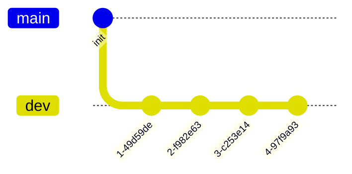
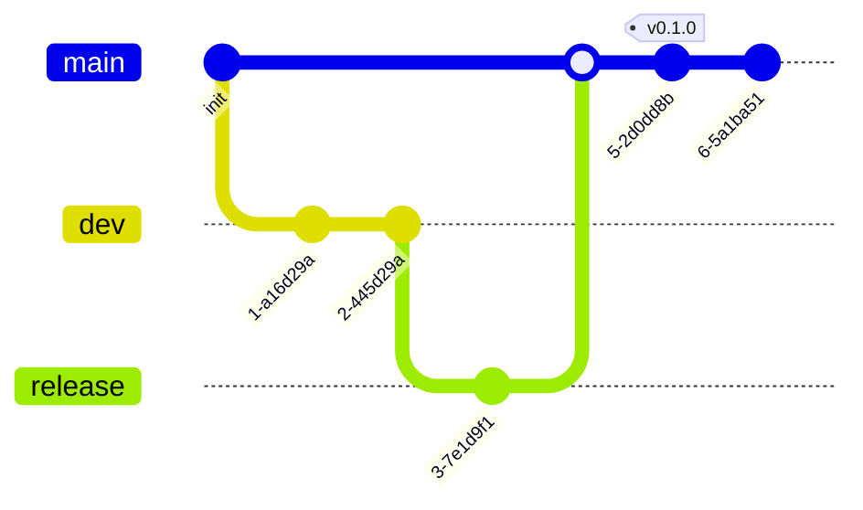
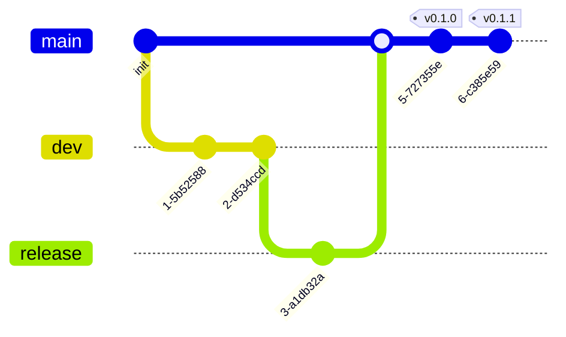
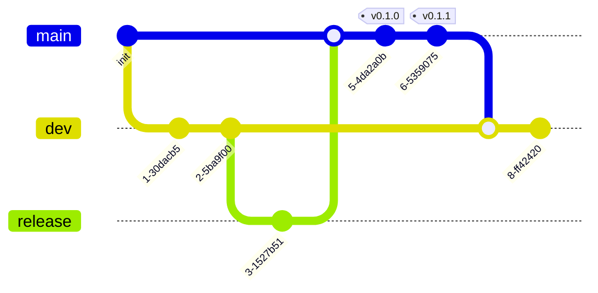

## Git 브랜치 전략

:exclamation::exclamation: GitGraph에서 merge와 commit이 분리되어 보이는데, 이것을 하나로 간주하고 보시면 됩니다.

### Branch name convention

- `feat/<feature-name>`: 새로운 기능
- `fix/<fix-name>`: 버그 수정
- `chore/<chore-name>`: 기타
- `hotfix/<hotfix-name>`: main에 바로 적용해야 하는 버그 수정
- `release/<version>`: staging

### Version

v로 시작하는 시맨틱 버저닝 2.0 사용 ex) `v1.0.0-beta.1`

### dev

```shell
git remote update --prune
```

```shell
git checkout -b <branch> origin/dev
```


작업 진행 -> PR to `origin/dev` -> merge 방식은 각 repo 규칙에 따름

- Squash and merge (title: `<type>: <name> (#<PR-number>)`)


- Merge pull request (title: `<type>: <name> (#<PR-number>)`)


- Rebase and merge (title: `<type>: <name> (#<PR-number>)`)



### release(stag)

dev -> rc.1 : https://hits-ai.atlassian.net/wiki/spaces/ONEPLATFOR/pages/589881#dev-%E2%86%92-stag(rc.1)
rc.1 -> rc.2 : https://hits-ai.atlassian.net/wiki/spaces/ONEPLATFOR/pages/589881#dev%EC%97%90-%EC%9E%88%EB%8A%94-%EB%AA%A8%EB%93%A0-%EC%B6%94%EA%B0%80-%EA%B0%9C%EB%B0%9C-%EC%82%AC%ED%95%AD%EC%9D%84-stag%EC%97%90-%EB%B0%98%EC%98%81

### main

stag -> main: https://hits-ai.atlassian.net/wiki/spaces/ONEPLATFOR/pages/589881#stag(rc.x)-%E2%86%92-main

### hotfix

```shell
git remote update --prune
```

```shell
git checkout -b hotfix/<hotfix-name> origin/main
```


작업 진행 -> PR to `origin/main` -> merge 방식은 각 repo 규칙에 따름

- Squash and merge (title: `<type>: <name> (#<PR-number>)`)
- Merge pull request (title: `<type>: <name> (#<PR-number>)`)
- Rebase and merge (title: `<type>: <name> (#<PR-number>)`)



```shell
git remote update --prune
```

```shell
git checkout origin/main
```

```shell
git tag <version>
```

```shell
git push --tags
```



PR `origin/main` to `origin/dev` -> Merge pull request(title: `hotfix: <name> (#<PR-number>)`)



Github 사이트 해당 Repo -> Releases -> Tags -> Create release -> Auto-generate release notes -> Publish release
